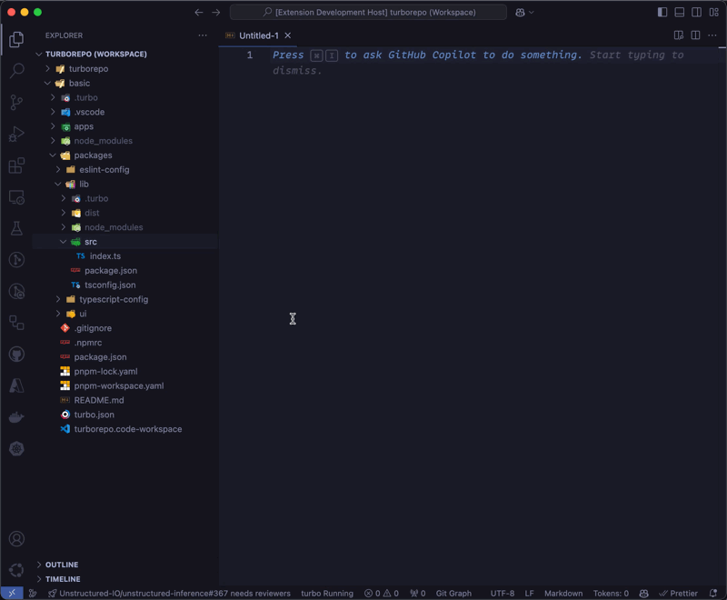

# MarkTree


Like the extension? [Contribute](https://github.com/Falven/marktree) to it, or consider [buying me a coffee.](https://buymeacoffee.com/lkpuiu42en).

MarkTree helps you quickly copy directory structures and file contents as Markdown. With a single click, generate a neatly formatted Markdown tree of your project’s folders, files, and code blocks—perfect for LLMs.

## Features

- **Copy MD Tree:** Copies a directory’s structure as a Markdown-formatted list.
- **Copy MD Files:** Copies the contents of files into Markdown code blocks.
- **Copy MD Both:** Copies both the directory tree and file contents in Markdown.

### Copy MD Tree on my-webapp/



```sh
my-webapp/
├── public
│   ├── index.html
│   └── favicon.ico
├── src
│   ├── main.js
│   └── utils.js
└── styles
    ├── base.css
    └── layout.css

3 directories, 6 files
```

## Copy MD Files on src/


src/main.js
```js
import { greet } from './utils.js';

console.log(greet('World'));
```

src/utils.js
```js
export function greet(name) {
  return \`Hello, \${name}!\`;
}
```

### Copy MD Both on src/

```sh
src/
├── main.js
└── utils.js

1 directories, 2 files
```

src/main.js

```js
import { greet } from './utils.js';

console.log(greet('World'));
```

src/utils.js

```js
export function greet(name) {
  return `Hello, \${name}!`;
}
```

## Requirements

No special dependencies are required. Just install and start copying Markdown trees and files!

## Extension Settings

MarkTree offers a few settings to customize your experience:

- `marktree.gitignore`: When enabled, respects all workspace `.gitignore`s to skip ignored files when copying.
- `marktree.showTreeCommand`: Show/hide the “Copy MD Tree” command in the context menu.
- `marktree.showContentsCommand`: Show/hide the “Copy MD Files” command.
- `marktree.showBothCommand`: Show/hide the “Copy MD Both” command.

## Known Issues

No known issues at this time. Please report any problems on our GitHub repository.

## Release Notes

### 0.0.1

- Initial release: “Copy MD Tree,” “Copy MD Files,” and “Copy MD Tree and Files” commands available.
- Respects `.gitignore` (configurable).
- Added settings to show/hide commands.

---

**Enjoy using MarkTree! 🌳**
